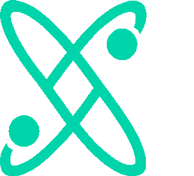

  

<h1 align="center">Privacy-Enhancing Technologies</h1>

  <em>A working bibliography of the primitives, architectures, and standards behind computational privacy.</em>

  Maintained by <a href="https://cosmocodex.com">Cosmo Codex Ltd</a> · <a href="https://cosmocodex.com/research">Research</a> · <a href="https://cosmocodex.com/services">Consulting</a>

---

## About this list

A curated reading list of the cryptographic primitives, architectures, and standards that make computational privacy possible. Maintained by [Cosmo Codex Ltd](https://cosmocodex.com), a UK privacy-first technology company.

This is the bibliography we work from when we consult on privacy-by-design, when we build privacy-respecting products, and when we publish [research](https://cosmocodex.com/research). Each entry below points to a primary source — the spec, the paper, or the reference implementation — not a marketing page.

> If you spot a missing entry, a broken link, or a better primary source than the one we cite, please open an issue or a PR. This list is meant to be useful, not exhaustive.

## Contents

- [Cryptographic privacy](#cryptographic-privacy)
  - [Fully homomorphic encryption (FHE)](#fully-homomorphic-encryption-fhe)
  - [Zero-knowledge proofs (ZKP)](#zero-knowledge-proofs-zkp)
  - [Secure multi-party computation (SMPC)](#secure-multi-party-computation-smpc)
  - [Post-quantum cryptography](#post-quantum-cryptography)
- [Confidential computing](#confidential-computing)
  - [Trusted execution environments (TEEs)](#trusted-execution-environments-tees)
  - [On-device inference](#on-device-inference)
  - [Federated learning](#federated-learning)
  - [Differential privacy](#differential-privacy)
- [Identity & sovereignty](#identity--sovereignty)
  - [Verifiable credentials & DIDs](#verifiable-credentials--dids)
  - [Selective disclosure (SD-JWT VC, BBS+)](#selective-disclosure-sd-jwt-vc-bbs)
  - [Age assurance](#age-assurance)
- [Emerging](#emerging)
  - [FHE hardware acceleration](#fhe-hardware-acceleration)
  - [Confidential AI](#confidential-ai)
  - [Machine unlearning](#machine-unlearning)
  - [Post-quantum ZKPs](#post-quantum-zkps)
- [Regulatory & legal references](#regulatory--legal-references)
- [About Cosmo Codex](#about-cosmo-codex)
- [License](#license)

---

## Cryptographic privacy

> Math you can verify, not policies you have to trust.

### Fully homomorphic encryption (FHE)

Computation directly on encrypted data without ever decrypting it. The holy grail of cryptographic privacy and, until recently, considered impractical. The last five years have changed that.

**Foundational papers**
- Craig Gentry, *Fully Homomorphic Encryption Using Ideal Lattices*, STOC 2009 — [PDF](https://crypto.stanford.edu/craig/craig-thesis.pdf)
- Zvika Brakerski, Craig Gentry, Vinod Vaikuntanathan, *(Leveled) Fully Homomorphic Encryption without Bootstrapping* (BGV), ITCS 2012 — [eprint](https://eprint.iacr.org/2011/277)
- Junfeng Fan, Frederik Vercauteren, *Somewhat Practical Fully Homomorphic Encryption* (BFV), 2012 — [eprint](https://eprint.iacr.org/2012/144)
- Jung Hee Cheon et al., *Homomorphic Encryption for Arithmetic of Approximate Numbers* (CKKS), ASIACRYPT 2017 — [eprint](https://eprint.iacr.org/2016/421)

**Standards**
- Homomorphic Encryption Standardization Consortium — [homomorphicencryption.org](https://homomorphicencryption.org)
- ISO/IEC 18033-8:2024 — Encryption algorithms · Part 8: FHE

**Implementations**
- [Microsoft SEAL](https://github.com/microsoft/SEAL) — BFV, CKKS · C++
- [OpenFHE](https://github.com/openfheorg/openfhe-development) — BFV, BGV, CKKS, FHEW/TFHE · C++ (successor to PALISADE)
- [HElib](https://github.com/homenc/HElib) — IBM · BGV, CKKS · C++
- [Lattigo](https://github.com/tuneinsight/lattigo) — Go
- [Concrete](https://github.com/zama-ai/concrete) — Zama · TFHE · Rust / Python
- [tfhe-rs](https://github.com/zama-ai/tfhe-rs) — Zama · Rust

### Zero-knowledge proofs (ZKP)

Prove a statement is true without revealing why. The basic primitive behind selective disclosure, anonymous credentials, and large parts of privacy-preserving identity.

**Foundational papers**
- Shafi Goldwasser, Silvio Micali, Charles Rackoff, *The Knowledge Complexity of Interactive Proof-Systems*, STOC 1985 — [PDF](https://groups.csail.mit.edu/cis/pubs/shafi/1985-stoc.pdf)
- Jens Groth, *On the Size of Pairing-based Non-interactive Arguments* (Groth16), EUROCRYPT 2016 — [eprint](https://eprint.iacr.org/2016/260)
- Mary Maller et al., *Sonic: Zero-Knowledge SNARKs from Linear-Size Universal and Updatable Structured Reference Strings*, CCS 2019 — [eprint](https://eprint.iacr.org/2019/099)
- Ariel Gabizon, Zachary J. Williamson, Oana Ciobotaru, *PlonK*, 2019 — [eprint](https://eprint.iacr.org/2019/953)
- Eli Ben-Sasson et al., *Scalable, transparent, and post-quantum secure computational integrity* (STARKs), 2018 — [eprint](https://eprint.iacr.org/2018/046)
- Benedikt Bünz et al., *Bulletproofs*, IEEE S&P 2018 — [eprint](https://eprint.iacr.org/2017/1066)

**Standards in progress**
- IETF CFRG — Anonymous Credentials working group
- ISO/IEC JTC 1/SC 27/WG 2 — Cryptography & security mechanisms

**Implementations**
- [arkworks-rs](https://github.com/arkworks-rs) — Rust ecosystem · Groth16, Marlin, KZG
- [circom](https://github.com/iden3/circom) + [snarkjs](https://github.com/iden3/snarkjs) — circuit DSL · zk-SNARKs
- [gnark](https://github.com/Consensys/gnark) — Go · Groth16, Plonk
- [Halo2](https://github.com/zcash/halo2) — Zcash · recursive SNARKs
- [Plonky2](https://github.com/0xPolygonZero/plonky2) — Polygon · Plonk + FRI
- [RISC Zero](https://github.com/risc0/risc0) — zkVM
- [StarkNet · Stwo](https://github.com/starkware-libs/stwo) — STARK prover

### Secure multi-party computation (SMPC)

Multiple parties jointly compute a function on their inputs without revealing those inputs to each other. Useful for anything where the parties don't trust each other but need a shared answer.

**Foundational papers**
- Andrew Chi-Chih Yao, *Protocols for Secure Computations*, FOCS 1982 — the original "Millionaires' Problem"
- Oded Goldreich, Silvio Micali, Avi Wigderson, *How to Play any Mental Game*, STOC 1987
- Michael Ben-Or, Shafi Goldwasser, Avi Wigderson, *Completeness Theorems for Non-Cryptographic Fault-Tolerant Distributed Computation* (BGW), STOC 1988

**Implementations**
- [MP-SPDZ](https://github.com/data61/MP-SPDZ) — research-grade MPC framework
- [EMP-toolkit](https://github.com/emp-toolkit) — efficient MPC suite · C++
- [ABY3 / ABY](https://github.com/encryptogroup/ABY) — 2-party · arithmetic + boolean + Yao
- [MOTION](https://github.com/encryptogroup/MOTION) — generic MPC framework
- [Carbyne Stack](https://github.com/carbynestack) — cloud-native MPC, built on MP-SPDZ

### Post-quantum cryptography

The cryptographic primitives that should still hold up after a sufficiently capable quantum computer arrives. Standardised in 2024.

**NIST standards (FIPS 2024)**
- [FIPS 203 — ML-KEM](https://csrc.nist.gov/pubs/fips/203/final) (Kyber) · key encapsulation
- [FIPS 204 — ML-DSA](https://csrc.nist.gov/pubs/fips/204/final) (Dilithium) · digital signatures
- [FIPS 205 — SLH-DSA](https://csrc.nist.gov/pubs/fips/205/final) (SPHINCS+) · stateless hash-based signatures
- [FIPS 206 — FN-DSA](https://csrc.nist.gov/projects/post-quantum-cryptography) (Falcon) · forthcoming
- [NIST PQC project](https://csrc.nist.gov/projects/post-quantum-cryptography)

**Implementations**
- [liboqs](https://github.com/open-quantum-safe/liboqs) — Open Quantum Safe · C
- [oqs-provider](https://github.com/open-quantum-safe/oqs-provider) — OpenSSL 3 provider
- [BoringSSL](https://boringssl.googlesource.com/boringssl/) — production ML-KEM in TLS 1.3
- [pq-crystals](https://github.com/pq-crystals) — reference Kyber, Dilithium

---

## Confidential computing

> Compute on data without seeing it.

### Trusted execution environments (TEEs)

CPU-enforced enclaves that protect code and data from the rest of the system — including the OS and the cloud provider.

**Hardware**
- Intel SGX, TDX — [Intel Trust Domain Extensions](https://www.intel.com/content/www/us/en/developer/articles/technical/intel-trust-domain-extensions.html)
- AMD SEV-SNP — [AMD Secure Encrypted Virtualization](https://www.amd.com/en/developer/sev.html)
- Arm CCA / Realms — [Arm Confidential Compute Architecture](https://www.arm.com/architecture/security-features/arm-confidential-compute-architecture)
- Apple Private Cloud Compute — [security guide](https://security.apple.com/documentation/private-cloud-compute/)
- AWS Nitro Enclaves — [docs](https://docs.aws.amazon.com/enclaves/)

**Frameworks**
- [Confidential Containers (CoCo)](https://github.com/confidential-containers) — Kubernetes-native
- [Open Enclave SDK](https://github.com/openenclave/openenclave) — Microsoft
- [Gramine](https://github.com/gramineproject/gramine) — LibOS for SGX
- [Confidential Computing Consortium](https://confidentialcomputing.io)

### On-device inference

Run language and vision models on the user's hardware. No data egress. No cloud bills.

**Runtimes**
- [llama.cpp](https://github.com/ggerganov/llama.cpp) — GGUF · C/C++ · CPU + GPU + Metal
- [MLX](https://github.com/ml-explore/mlx) — Apple · Apple Silicon-native
- [Ollama](https://github.com/ollama/ollama) — packaging + runtime on top of llama.cpp
- [ONNX Runtime](https://github.com/microsoft/onnxruntime) — cross-platform
- [TensorFlow Lite / LiteRT](https://github.com/google-ai-edge/LiteRT)
- [Apple Core ML](https://developer.apple.com/documentation/coreml) — iOS/macOS
- [Android NNAPI](https://developer.android.com/ndk/guides/neuralnetworks) / [LiteRT for Android](https://ai.google.dev/edge/litert)

**Browser-native**
- [WebGPU](https://www.w3.org/TR/webgpu/) — W3C spec
- [Transformers.js](https://github.com/huggingface/transformers.js) — browser inference via ONNX
- [WebLLM](https://github.com/mlc-ai/web-llm) — LLMs in the browser

### Federated learning

Train a model across many devices without centralising the training data.

**Foundational papers**
- H. Brendan McMahan et al., *Communication-Efficient Learning of Deep Networks from Decentralized Data* (FedAvg), AISTATS 2017 — [arXiv](https://arxiv.org/abs/1602.05629)
- Peter Kairouz et al., *Advances and Open Problems in Federated Learning*, 2021 — [arXiv](https://arxiv.org/abs/1912.04977)

**Frameworks**
- [TensorFlow Federated](https://github.com/tensorflow/federated)
- [Flower](https://github.com/adap/flower) — framework-agnostic
- [PySyft / OpenMined](https://github.com/OpenMined/PySyft)
- [FedML](https://github.com/FedML-AI/FedML)

### Differential privacy

Mathematical guarantee that a query result is essentially the same whether or not any one person's data is in the dataset. The privacy budget framework.

**Foundational papers**
- Cynthia Dwork, *Differential Privacy*, ICALP 2006 — [PDF](https://www.iacr.org/archive/eurocrypt2006/40040428/40040428.pdf)
- Cynthia Dwork, Aaron Roth, *The Algorithmic Foundations of Differential Privacy*, 2014 — [book](https://www.cis.upenn.edu/~aaroth/Papers/privacybook.pdf)

**Libraries**
- [OpenDP](https://github.com/opendp/opendp) — Harvard / Microsoft collaboration
- [Google differential-privacy](https://github.com/google/differential-privacy) — Go, C++, Python
- [IBM diffprivlib](https://github.com/IBM/differential-privacy-library)
- [Opacus](https://github.com/pytorch/opacus) — DP for PyTorch
- [Tumult Analytics](https://gitlab.com/tumult-labs/analytics)

---

## Identity & sovereignty

> Prove things about yourself without giving up everything.

### Verifiable credentials & DIDs

W3C-standardised primitives for portable, cryptographically verifiable identity. The foundation for self-sovereign identity.

**Standards**
- [W3C Verifiable Credentials Data Model v2.0](https://www.w3.org/TR/vc-data-model-2.0/)
- [W3C Decentralized Identifiers (DIDs) v1.0](https://www.w3.org/TR/did-core/)
- [DIF — Decentralized Identity Foundation](https://identity.foundation)
- [eIDAS 2.0 / EUDI Wallet ARF](https://github.com/eu-digital-identity-wallet/eudi-doc-architecture-and-reference-framework)

**Implementations**
- [Veramo](https://github.com/uport-project/veramo) — TypeScript framework for VCs and DIDs
- [Spruce DIDKit](https://github.com/spruceid/didkit) — Rust, with bindings
- [Aries Cloud Agent Python (ACA-Py)](https://github.com/hyperledger/aries-cloudagent-python)
- [Walt.id SSI Kit](https://github.com/walt-id/waltid-ssikit)

### Selective disclosure (SD-JWT VC, BBS+)

Present only the attributes a verifier needs, with cryptographic linkability across presentations under your control.

**Standards**
- [IETF — SD-JWT (Selective Disclosure for JWTs)](https://datatracker.ietf.org/doc/draft-ietf-oauth-selective-disclosure-jwt/)
- [IETF — SD-JWT VC profile](https://datatracker.ietf.org/doc/draft-ietf-oauth-sd-jwt-vc/)
- [IETF — BBS Signature Scheme](https://datatracker.ietf.org/doc/draft-irtf-cfrg-bbs-signatures/)

**Foundational papers**
- Dan Boneh, Ben Lynn, Hovav Shacham, *Short Signatures from the Weil Pairing*, 2001 — origin of BLS / BBS
- Stefan Brands, *Rethinking Public Key Infrastructures and Digital Certificates*, 2000 — selective disclosure foundations

**Implementations**
- [sd-jwt-rs](https://github.com/openwallet-foundation-labs/sd-jwt-rust) — Rust
- [sd-jwt-js](https://github.com/openwallet-foundation-labs/sd-jwt-js) — TypeScript
- [pairing-crypto](https://github.com/mattrglobal/pairing_crypto) — BBS+

### Age assurance

Establish a user's age range without disclosing identity. A subject of active UK/EU regulation.

**Regulatory framework**
- [ICO Children's Code (Age Appropriate Design Code)](https://ico.org.uk/for-organisations/uk-gdpr-guidance-and-resources/childrens-information/childrens-code-guidance-and-resources/age-appropriate-design-a-code-of-practice-for-online-services/)
- [Ofcom — Online Safety Act codes of practice](https://www.ofcom.org.uk/online-safety/)
- [BSI PAS 1296 — Online age verification](https://www.bsigroup.com/en-GB/standards/PAS1296/)

**Standards & research**
- [W3C Age Verification CG](https://www.w3.org/community/age-verification/)
- [euCONSENT — EU age verification](https://www.euconsent.eu)

---

## Emerging

> What we are watching, testing, and contributing to.

### FHE hardware acceleration

Bringing FHE from "slow but possible" to "competitive with plaintext compute."

- [Intel HEXL](https://github.com/intel/hexl) — homomorphic encryption acceleration library
- [DARPA DPRIVE](https://www.darpa.mil/program/data-protection-in-virtual-environments) — purpose-built FHE accelerator program
- [Cornami](https://www.cornami.com) — FHE-targeted reconfigurable hardware
- Niobium Microsystems — FHE accelerator silicon

### Confidential AI

Combining confidential computing and AI inference so neither the model nor the prompt nor the output is visible to the host.

- [Apple Private Cloud Compute](https://security.apple.com/blog/private-cloud-compute/) — design paper
- [NVIDIA H100 Confidential Computing](https://www.nvidia.com/en-gb/data-center/solutions/confidential-computing/)
- [AMD SEV-SNP for AI workloads](https://www.amd.com/en/developer/sev.html)
- [Confidential AI working group · CCC](https://confidentialcomputing.io)

### Machine unlearning

Methods for genuinely removing a data point's influence from a trained model, beyond simply deleting it from the training set.

- Lucas Bourtoule et al., *Machine Unlearning*, IEEE S&P 2021 — [PDF](https://www.ieee-security.org/TC/SP2021/SP21-Papers/machine_unlearning.pdf)
- Thomas Bonawitz et al., *Towards Machine Unlearning at Scale* — research direction
- [NeurIPS Unlearning Challenge](https://unlearning-challenge.github.io)

### Post-quantum ZKPs

Zero-knowledge proof systems with quantum-resistant security assumptions.

- STARKs (already lattice/hash-based, post-quantum) — see ZKP section
- [Plonky2](https://github.com/0xPolygonZero/plonky2) — Plonk + FRI, no trusted setup
- Banquet, Picnic — PQ-secure signature schemes from MPC-in-the-head
- IETF CFRG — early PQ ZKP standardisation discussions

---

## Regulatory & legal references

The statutes and standards our consulting work cites most often.

**United Kingdom**
- [UK GDPR](https://www.legislation.gov.uk/eur/2016/679/contents) (retained EU Regulation 2016/679)
- [Data Protection Act 2018](https://www.legislation.gov.uk/ukpga/2018/12/contents)
- [Online Safety Act 2023](https://www.legislation.gov.uk/ukpga/2023/50/contents)
- [Investigatory Powers Act 2016](https://www.legislation.gov.uk/ukpga/2016/25/contents)
- [Equality Act 2010 — §149 Public Sector Equality Duty](https://www.legislation.gov.uk/ukpga/2010/15/section/149)
- [ICO guidance index](https://ico.org.uk/for-organisations/)
- [Ofcom — online safety](https://www.ofcom.org.uk/online-safety/)

**European Union**
- [GDPR](https://eur-lex.europa.eu/eli/reg/2016/679/oj)
- [EU AI Act](https://artificialintelligenceact.eu)
- [Digital Services Act](https://eur-lex.europa.eu/eli/reg/2022/2065/oj)
- [eIDAS 2.0](https://eur-lex.europa.eu/eli/reg/2024/1183/oj)

**Standards**
- [ISO/IEC 27001 — Information security management](https://www.iso.org/standard/27001)
- [ISO/IEC 27701 — Privacy information management](https://www.iso.org/standard/71670.html)
- [ISO/IEC 42001 — AI management systems](https://www.iso.org/standard/42001)
- [ISO/IEC 27018 — PII protection in public clouds](https://www.iso.org/standard/76559.html)
- [NIST Privacy Framework](https://www.nist.gov/privacy-framework)
- [NIST AI Risk Management Framework](https://www.nist.gov/itl/ai-risk-management-framework)
- [NIST FRVT (Face Recognition Vendor Test)](https://www.nist.gov/programs-projects/face-recognition-vendor-test-frvt)

**Case law (UK)**
- *R (Bridges) v Chief Constable of South Wales Police* [2020] EWCA Civ 1058 — facial recognition
- *Big Brother Watch v United Kingdom* (App. No. 58170/13, ECtHR 2021) — bulk interception
- *Lloyd v Google* [2021] UKSC 50 — representative actions for data protection

---

## About Cosmo Codex

[Cosmo Codex Ltd](https://cosmocodex.com) is a UK privacy-first technology company. We build software, advise on compliance, and publish evidence-driven research.

**Products**
- [Social Neuron](https://socialneuron.com) — AI-powered social media management with privacy by design
- [TheVPNMatrix](https://thevpnmatrix.com) — evidence-based VPN comparison platform
- Hearth — local-first AI runtime (in private development)

**Research using these primitives**
- [UK Digital ID: Ten Safeguards Parliament Must Legislate](https://cosmocodex.com/research/uk-digital-id-ten-safeguards)
- [Facial Recognition in the UK: Built Before Parliament Authorised It](https://cosmocodex.com/research/facial-recognition-uk-statutory-basis)
- [How We Score VPN Evidence: TheVPNMatrix Methodology Explained](https://cosmocodex.com/research/vpn-evidence-methodology)
- [Privacy-by-Design and Why It Matters for UK Businesses](https://cosmocodex.com/research/privacy-by-design-uk-businesses)
- [AI Governance: What UK Businesses Need to Know](https://cosmocodex.com/research/ai-governance-uk-businesses)
- [A Practical Guide to GDPR Compliance for UK Startups](https://cosmocodex.com/research/gdpr-compliance-guide-startups)

**Consulting**
We advise UK organisations on data protection, AI governance, and online safety compliance. See [cosmocodex.com/services](https://cosmocodex.com/services) for engagement scopes.

**Contact** · [info@cosmocodex.com](mailto:info@cosmocodex.com)

Registered in England and Wales · Company No. 16627148 · 20 Wenlock Road, London N1 7GU

---

## Contributing

Pull requests welcome. Ground rules:

1. **Primary sources only.** Link to the spec, the paper, or the reference implementation — not a blog post that summarises one.
2. **Working links.** PRs that add or fix links must be checked at submission time.
3. **Categorise honestly.** "Emerging" means actively pre-standardisation. If a primitive has a published spec, it belongs in the relevant standardised category.
4. **No marketing pages.** Vendor sites are acceptable only where they host primary technical documentation.
5. **One PR per category.** Easier to review.

If you maintain a project that should be listed, file an issue with a one-line description and we will review.

## License

This bibliography is released under [Creative Commons Attribution 4.0 International (CC BY 4.0)](https://creativecommons.org/licenses/by/4.0/). You are free to copy, redistribute, and adapt the material with attribution to Cosmo Codex Ltd.

The linked works remain under their respective licenses.
